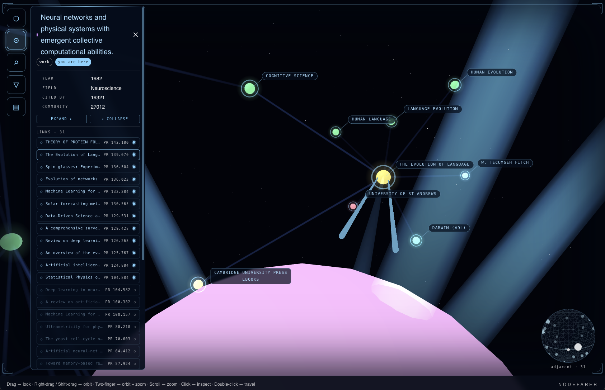

# Nodefarer

An egocentric 3D navigator for large graphs. Instead of drawing the whole graph,
you *park* on a node — like a ship at a star — and explore outward: inspect
neighbours, travel along edges, bound the view with filters, and jump across
"wormhole" links to distant-but-related regions.

The bundled demo flies through a slice of the [OpenAlex](https://openalex.org)
scholarly graph, tracing the lineage from **Hopfield's 1982 associative-memory
paper to modern attention / transformer models**.



*Parked on Hopfield's 1982 paper with the inspector open; reticles tag the
brightest neighbours, and the activation rail sits down the left edge.*

> Status: early. The navigation spine (camera, travel, inspect, search, filter,
> expand/collapse) works; the nebula overview, guided tours, and agent copilot
> are planned. See `docs/exploration-design.md`.

---

## The bundled data

The demo loads a self-contained `public/bundle.json` — a bounded slice baked from
OpenAlex by the ingest pipeline:

- **Nodes** — *works* (papers), plus the *authors*, *concepts*, *venues*, and
  *institutions* attached to them. Works carry `year`, `cited_by`, `field`,
  a Louvain `community` (their "galaxy" colour), and a `pagerank` centrality
  (their brightness).
- **Edges** — **structural**: `cites`, `authored_by`, `has_concept`,
  `published_in`, `affiliated_with`; and **semantic** "**wormholes**"
  (`similar_to`) inferred from embedding similarity — links between papers that
  are about the same thing but don't cite each other.
- The slice is grown from seed papers by best-first search over citations,
  ranked by PageRank, so you get the high-signal backbone rather than a hairball.

If `public/bundle.json` is absent the app falls back to a small synthetic graph,
so it always runs. (The bundle is gitignored; regenerate it with the ingest
pipeline — see below.)

---

## Walkthrough — what the UX does today

Open the app and you start **parked on a node** (the highest-PageRank work, or a
seed). The scene is a bounded neighbourhood around you; reticles tag the
brightest nearby bodies with their titles.

**Moving the camera**

| Gesture | Action |
|---|---|
| Drag | Look around |
| Right-drag / Shift-drag / two-finger drag | Orbit the current node |
| Scroll / pinch | Zoom |
| Click a node | Inspect it |
| Double-click a node | Travel to it |

**Travel.** Double-click any node and the ship flies there along the
graph-shortest path; the **blast doors** shut while the universe re-lays-out, then
part to reveal the settled scene. The route's edges stay lit during the flight.

**The activation rail** (left edge) — click an icon and a panel deploys with a
staged animation; one is open at a time:

- **⬡ Current node** — where you're parked; jump into the full inspector.
- **⊙ Inspector** — the selected node's properties and its **links** list. Each
  link can be pinned (bracketed in the viewport), shown/hidden, or travelled.
  Wormhole links show their similarity and a "jump to" action.
- **⌕ Scanner** — text-search any node in the dataset and land on it.
- **▽ Filter** — *schema-driven* bounds, split into **Nodes** and **Edges**: toggle
  types, and constrain properties (PageRank, year, field, …) discovered from the
  data. It's a reversible mask — the node you're on is always kept.
- **▤ Ship console** — view mode, **edges-per-node budget** (declutter a hub down
  to its strongest links), the **sort/clip property**, edge & wormhole
  visibility, and a manual blast-doors toggle.

**Expand / collapse.** From the inspector, *expand* a node to pull in its top
neighbours, or *collapse* to fold it back down — both happen behind the blast
doors so the layout never visibly thrashes.

Collapse is anchored to the **true shortest path** from where the ship currently
sits (computed over the whole dataset, not just what's on screen):

- The collapsed node is kept and re-anchored to its shortest-path edge — that
  edge stays (and *reappears* if an earlier collapse had removed it), so the
  node remains and can always be re-expanded. Expand and collapse are a clean
  pair.
- All of the node's *other* edges are removed, and any node left with **no
  remaining visible path** to the ship folds away with it. A node that's still
  reachable another way stays put.
- So in a graph, collapsing a hub doesn't necessarily delete its neighbours —
  only the ones that depended on it. In a **tree** (no alternate paths) this
  reduces to exactly the familiar "collapse hides the whole subtree."
- It's symmetric with travel: collapse folds along the shortest path, and
  travelling back re-unfolds along it, reopening just those edges.

**Wormholes.** Semantic links render as violet conduits. Crossing one is the
payoff of the Hopfield demo: from the early associative-memory backbone, jump the
wormhole into the modern attention lineage in a visibly distant community.

---

## Run it

Requires Node and npm.

```bash
npm install
npm run dev        # http://localhost:5173
```

That runs the offline demo over the bundled (or synthetic) graph — no backend
needed.

### Live backend (optional)

Point the client at the Go/Chi + Neo4j backend (`backend/`) to explore a live
store instead of the static bundle:

```bash
VITE_API_URL=http://<host>:8080 npm run dev
```

The app speaks one `GraphSource` interface with two implementations
(`StaticBundleSource` over the bundle, `ApiSource` over the backend), so the same
UX drives either source.

---

## Demo mode (recording a promo clip)

`?demo=1` plays a hands-off, **looping** product demo for a short screen capture. It
keeps the full UI (viewport frame, HUD, node inspector) and drives the app's real
mechanics on a fixed timeline — the interface is the thing being shown off. It's
completely inert without the param; normal behaviour is unchanged.

```
http://localhost:5173/?demo=1
```

The loop (~30s) runs the app's actual handlers, not a canned video:

1. Start on the hero node with the blast doors shut.
2. Doors open; the node's inspector panel opens.
3. Travel to an adjacent node, then back to the original.
4. Inspector opens again.
5. Cluster the graph into nebulae (fields → galaxies — the live reform animation).
6. Reorient (orbit + gaze, same altitude) to bring several fields into view.
7. Fold the distant fields into clouds (watched from that framing).
8. Lock onto one of the framed fields and bloom it back open.
9. Travel into that visible cluster.
10. Look back toward the start.
11. Doors close — and the loop resets and repeats, identically every time.

**Recording (macOS):** size the browser window to roughly **1200×1200 px** (small,
square — meant to be viewed muted and looped on a phone feed), load `?demo=1`, then
`Cmd+Shift+5` → **Record Selected Portion** over the graph. The loop closes the doors
between iterations, so any full cycle records as a clean seam. Reload to restart.

**Tweaks** (all in [`src/demo/demoConfig.ts`](src/demo/demoConfig.ts)):

- **Start node** — default is *"Attention Is All You Need"*; override per-recording
  with `?demo=1&node=<id>`, or change `HERO_DEFAULT`.
- **Neighbourhood size** — `ENTRY_MAX_NODES` bounds how much of the hero's
  neighbourhood loads (keeps it readable, not a hairball).
- **Pacing** — the `DEMO` dwell times (ms per beat). Travel flights and the nebula
  reform take their own time on top, so the whole loop lands around 30s.

Node layout is seeded (`seedDeterministicRandom`) in demo mode, so every loop and
every take lays out identically.

---

## Regenerating the demo bundle

The bundle is produced by the Python ingest pipeline (OpenAlex → Neo4j →
embeddings → bundle). See [`ingest/README.md`](ingest/README.md) for the full
pipeline; the last step is:

```bash
ingest/.venv/bin/python ingest/export_bundle.py --max-works 2000
# then copy ingest/data/bundle.json -> public/bundle.json
```

Backend setup lives in [`backend/README.md`](backend/README.md).

---

## Tech

React + TypeScript + Vite, [react-three-fiber](https://github.com/pmndrs/react-three-fiber)
/ three.js for the scene, d3-force-3d for layout, MUI for the HUD. Backend is Go
(Chi) over Neo4j with a vector index for semantic search.

## License

[Apache 2.0](LICENSE).
